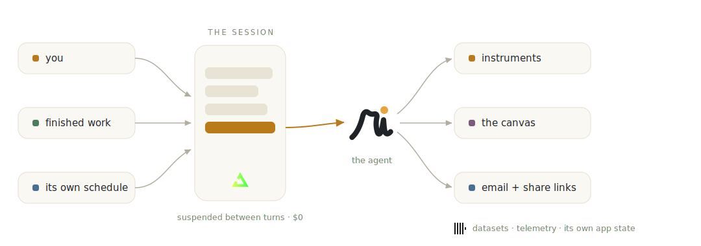

<p align="center">
  <picture>
    <source media="(prefers-color-scheme: dark)" srcset="brand/rendi-wordmark-dark.svg">
    
  </picture>
</p>

<p align="center"><strong>rendi</strong>, an agent harness on top of Trigger.dev, wearing analytics as its first skin.</p>

<p align="center">
  <a href="https://rendi.help">rendi.help</a> ·
  <a href="docs/DEPLOYMENT.md">deploy your own</a> ·
  <a href="docs/AGENT_DEPLOY.md">let an agent deploy it for you</a>
</p>

<p align="center">
  <a href="https://github.com/mcheemaa/rendi/actions/workflows/ci.yml"></a>
  
  
  
</p>

<!-- demo: product walkthrough video lands here -->

Rendi (Italian, from rendere, to render and to give back) turns questions about data
into interfaces. Ask, and the answer streams in as a live chart. Drag its time
window, regroup it, and it re-queries ClickHouse in milliseconds with the model
nowhere in the loop. Ask a follow-up and the agent already knows what you changed.

Underneath is a full agent, not a chat endpoint. Each conversation is a durable
session that keeps living after the tab closes. It loads datasets in the background
and wakes itself when the rows land. It schedules its own heartbeats. It keeps every
board it has built for you alive, reviews its own work through a real browser, and
when something is worth seeing it writes you an email with a live link. Between
turns it suspends and costs nothing, because there is no machine anywhere to keep
alive.

<p align="center">
  <picture>
    <source media="(prefers-color-scheme: dark)" srcset="brand/rendi-harness-dark.svg">
    
  </picture>
</p>

## The contract

1. Every meaningful answer becomes an instrument you operate, not text you scroll past.
2. An instrument stays connected to live data. No frozen numbers, ever.
3. You steer it without invoking the model again.
4. Everything you do to it becomes state the agent sees on its next turn.

The fourth is the one that changes the feel. Steer a chart to a seven-day window,
ask a question with no context, and the answer arrives inside the window you set.
Drag a note across the board while the agent sleeps, and next turn it knows what
your hands did.

## The canvas

Every conversation owns a board. The agent composes charts, notes, images, and
hand-built D3 pages onto it. You drag, resize, and steer the same blocks. Both
pairs of hands write to one durable log, and the board is still alive when you come
back a month later. A share link hands anyone the live thing, steerable, no login.

## The architecture

| ClickHouse | Trigger.dev |
| --- | --- |
| every instrument re-executes live through a guarded read-only role | every conversation is a durable session that survives refreshes, deploys, and weeks of idle |
| datasets load from S3 at tens of millions of rows | finished background work wakes the agent with the results |
| 262k commits of engineering history, kept fresh from the GitHub API | the agent provisions and removes its own schedules |
| the agent's own telemetry, every turn, query, token, and cost, queryable by the agent itself | a real Chromium inside the worker, so it can look at its own boards |
| the product's Postgres state, joined live through postgresql() | serialized, idempotent ingestion queues |
| spans dual-emitted to ClickStack | realtime streaming with resume, out-of-band turns rendering live |

The part worth stealing is the shape. The session is the agent's inbox, and the
user is only one of three writers. People write to it, finished background work
writes to it, and the agent's own schedules write to it. The agent wakes for any of
them with its full memory. Each conversation becomes a long-running process that
happens to be readable, its state in the log instead of in a machine. Standby costs
zero by architecture, not as a feature, because between turns the agent's computer
does not exist.

## The harness underneath

The agent is one markdown file. Every capability is one tool file beside it, and
the persistence, readback, telemetry, and canvas machinery underneath do not care
what the tools do. Strip the analytics tools and wire your own: the inbox pattern,
the heartbeats, the self-review, and the zero-cost standby all come with the
harness. We made it an analyst. You can make it anything.

## How it compares

- BI tools (Tableau, Metabase) give you dashboards someone authored for you. Rendi
  authors the dashboard inside the conversation, and it stays alive afterward.
- Analytics notebooks (Hex, Evidence) ship the same live-parameterized machinery,
  written by a developer at build time. Here the agent writes it per answer, and
  reads back what you changed.
- SQL assistants (MotherDuck's, the warehouse consoles) hand you a result set.
  Rendi hands you an instrument, and remembers how you left it.
- Agent platforms and sandboxes (e2b, exe.dev) start from "an agent needs a
  machine" and bill while it exists. This harness gives an agent a browser, a
  scheduler, and email, with nothing to keep alive between turns.

## Run it locally

You need keys for Anthropic, ClickHouse, Neon, and Trigger.dev.
[docs/DEPLOYMENT.md](docs/DEPLOYMENT.md) walks every value.

```console
pnpm install
cp .env.example .env.development.local        # fill in
pnpm db:migrate                               # Postgres schema
node --env-file=.env.development.local scripts/seed-clickhouse.mts    # roles + git history
node --env-file=.env.development.local scripts/setup-app-views.mts    # app state, live in ClickHouse
pnpm dev                                      # the app
npx trigger.dev@4.5.4 dev --env-file .env.development.local           # the agent
```

Open `localhost:3000` and ask for a chart. The component workshop runs on
`pnpm storybook`. The gates are `pnpm lint && pnpm typecheck && pnpm test &&
pnpm build`, and accessibility violations fail the suite by design.

## Deploying

[docs/DEPLOYMENT.md](docs/DEPLOYMENT.md) for humans. [docs/AGENT_DEPLOY.md](docs/AGENT_DEPLOY.md)
is written for an AI agent deploying on your behalf. Paste it to your assistant and
it collects the values from you and drives the deploy end to end.

## Working in the repo

[AGENTS.md](AGENTS.md) is the working constitution. Product law, code standards, UI
standards, the gates. [CONTRIBUTING.md](CONTRIBUTING.md) has the short version, and
security reports go through [SECURITY.md](SECURITY.md).

## License

MIT. See [LICENSE](LICENSE). Rendi was built during the
[ClickHouse and Trigger.dev Virtual Summer Hackathon 2026](https://triggerdev.clickhouse.com/).
Thanks to both teams for infrastructure good enough to build this on in a week.
